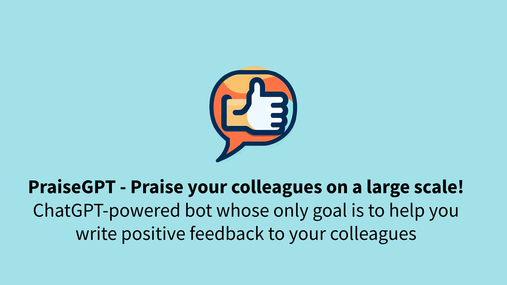

# Enterprise Prompt Engineering - Your company's very own ChatGPT

This is an alternative app (frontend and backend) for the [ChatGPT + Enterprise data with Azure OpenAI and Cognitive Search](https://github.com/Azure-Samples/azure-search-openai-demo/) project.

<p align="center">
    
</p>

### Web application (installable, offline-ready)

[EnterPrompt](https://enterprise.promptengineering.rocks/) - ChatGPT-powered bot which only uses your enterprise data

## Getting Started

### Frontend

First, run the development server:

```bash
cd app
npm install
npm run dev
```

Open [http://localhost:3000](http://localhost:3000) with your browser to see the result.

### Backend

There are 2 options available:

- running API from external server (hosted demo). You can only use the data that is already there.
- locally. Then you can upload your own data and create your own flavor of assistant (and deploy it if you wish). Running locally requires Azure account - you can get one with $200 credit for free [here](https://aka.ms/free-azure-pass).

#### Running API from external server

Just rename `.env.external-api.local` to `.env.local` and you are good to go. You will use https://enterprise.promptengineering.rocks/api as a backend proxied via Rapid API to deal with CORS.

#### Running API locally

1. Install [Python 3+](https://www.python.org/downloads/), [Azure CLI](https://learn.microsoft.com/cli/azure/install-azure-cli), and [Azure Functions Core Tools](https://learn.microsoft.com/en-us/azure/azure-functions/functions-run-local?tabs=v4%2Cwindows%2Ccsharp%2Cportal%2Cbash#v2)

2. In your Azure account create a new resource group with the following services (free or lowest tier is fine):

- Azure OpenAI Service with 2 model deployments: text-davinci-003 and gpt-35-turbo
- Azure Cognitive Search service. Free tier is fine.
- Form Recognizer. Free tier is fine.
- Azure Storage
- Azure Static Web Apps (if you want to deploy your app later). Free tier is fine.

3. Prepare your data.

- Replace PDFs in the data folder with your own ones.
- Rename `scripts/.env.template` to `scripts/.env` and enter services names and keys from the previous step there.
- Run `./scripts/prepdocs.ps1` or `./scripts/prepdocs.sh` (depending on your OS). This script will upload your PDFs to Azure Storage (split into pages) and create a new index in Azure Cognitive Search.

4. In `app/api/` folder rename `local.settings.template.json` to `local.settings.json` and fill in the values there by the names, endpoints, keys from the first step.

5. Run `func start` in `app/api/` folder. This will start Azure Functions locally.

6. You might also want to fine-tune prompts, quickstarts, and suggestions in JSON files located in `app/api/promptengineering` and `app/promptengineering` folders. 

You are fully ready to interact with your own assistant now!

## About

### Author

[Maxim Salnikov](https://twitter.com/webmaxru). Feel free to contact me if you have any questions about the project, PWA, Web Push, etc.

### License

This project is licensed under the terms of the MIT license.
